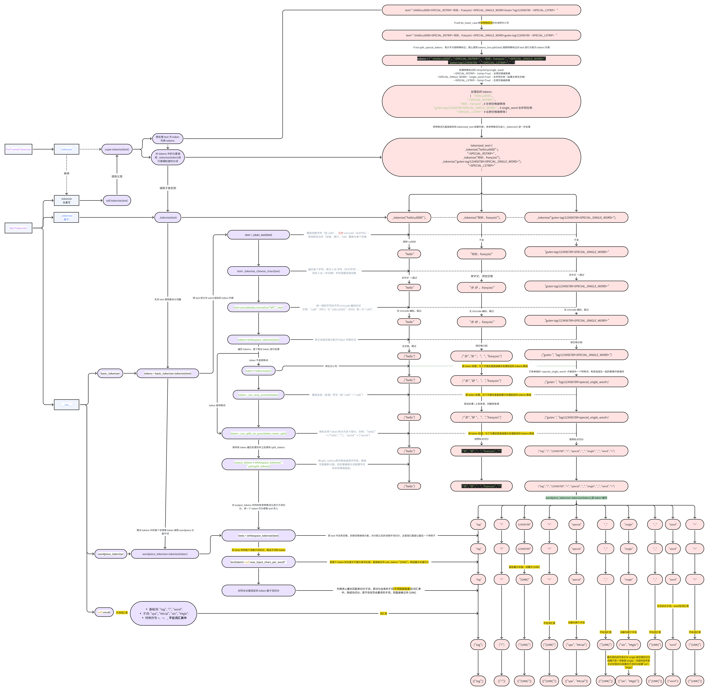

# Bert 
> `Bert` 是谷歌团队在 `2018` 年发布的一种基于 `Transformer` 编码器架构的预训练模型。官方只有 [tensorflow](https://github.com/google-research/bert) 版本的代码，基于 `pytorch` 的实现可以参考 `huggingface` 的 [transformers](https://github.com/huggingface/transformers) 库。其中，`Bert` 所在的路径为:`src\transformers\models\bert`

<!-- TOC -->

- [Bert](#bert)
    - [huggingface transformers](#huggingface-transformers)
    - [源码解读](#%E6%BA%90%E7%A0%81%E8%A7%A3%E8%AF%BB)
        - [Tokenizer vs vocabulary](#tokenizer-vs-vocabulary)
            - [vocabulary](#vocabulary)
            - [Tokenizer](#tokenizer)
                - [tokenizers 库](#tokenizers-%E5%BA%93)
                - [Tokenizer 类主要方法](#tokenizer-%E7%B1%BB%E4%B8%BB%E8%A6%81%E6%96%B9%E6%B3%95)
        - [BertTokenizer](#berttokenizer)
            - [初始化流程](#%E5%88%9D%E5%A7%8B%E5%8C%96%E6%B5%81%E7%A8%8B)
            - [主要方法](#%E4%B8%BB%E8%A6%81%E6%96%B9%E6%B3%95)
                - [tokenize](#tokenize)
                    - [预处理](#%E9%A2%84%E5%A4%84%E7%90%86)
                    - [_tokenize](#_tokenize)
                    - [BasicTokenizer](#basictokenizer)
                    - [WordpieceTokenizer](#wordpiecetokenizer)
                    - [流程图](#%E6%B5%81%E7%A8%8B%E5%9B%BE)
                - [encode](#encode)
                    - [encode_plus](#encode_plus)
            - [主要方法使用示例](#%E4%B8%BB%E8%A6%81%E6%96%B9%E6%B3%95%E4%BD%BF%E7%94%A8%E7%A4%BA%E4%BE%8B)

<!-- /TOC -->

## huggingface transformers
> 中文文档在此：[transformers_zh](https://huggingface.co/docs/transformers/v4.51.3/zh/index)
以下是该库的简要的发展历程：
1. 最初阶段 (`2018`年) ：`Hugging Face` 发布了 `pytorch-pretrained-bert` 库，专注于提供 `PyTorch` 实现的 `BERT` 预训练模型。
2. 扩展阶段 (`2019`年) ：随着更多 `Transformer` 模型（如 `GPT-2`、`XLNet` 等）的加入，库更名为 `pytorch-transformers` ，但仍然主要支持 `PyTorch`。
3. 多框架支持 (`2019`年底) ：为了支持 `TensorFlow` 和其他框架，库最终更名为 `transformers` ，成为我们现在所知的跨框架 `Transformer` 模型库。

## 源码解读
本节，我们分析一下`transformers`中`bert`的源码。
> 参考文献：
> 1. [BERT 源码详解 - CSDN](https://blog.csdn.net/javastart/article/details/120999800)
> 2. [BERT pytorch 实现](https://github.com/codertimo/BERT-pytorch/tree/master/bert_pytorch)

### Tokenizer vs vocabulary
> 在介绍`BertTokenizer`之前，我们先要了解一下什么是`Tokenizer`，以及`Tokenizer`和`vocabulary`之间的关系。

#### vocabulary
> `vocabulary` 即 `vocab`、词汇表、词表。其功能很简单，简单概括就是“存词”：存储所有可能的 `token` 及其对应的唯一索引（`ID`），用于将文本转换为数值形式（例如：单词 → 整数索引）。

* 当词表以文件的形式保存时，通常是如下的形式:<br><br>
    ```txt
    <unk>
    <pad>
    <sos>
    <eos>
    ...
    wordN
    ```
* 将词表加载到内存中时，通常是使用一个顺序字典（`OrderedDict`）来存储，其中键为单词，值为索引。

#### Tokenizer
> `Tokenizer` 是分词工具，其核心功能是 ​将原始文本转换为模型可处理的数值形式。

##### tokenizers 库
> `Hugging Face` 的 `tokenizers` 库可以帮助我们构建`Tokenizer`，请注意`tokenizers` 和 `transformers` 是两个不同的库，前者可以单独拿出来为我们的 `NLP` 任务构建分词器，适合需要从头训练分词器的场景（例如领域特定文本处理）。
但其实 `transformers` 库中也内置了构建 `Tokenizer` 的功能。我们这里主要介绍前者，后续讲解`BertTokenizer`时，其实使用的就是`transformers`库中内置的分词器。

接下来我们展示一下`tokenizers`库的使用方法：<font color='red'>假设我们没有词表，而是直接从原始数据开始构建</font>一个`Tokenizer`，`get_all_sentences`函数每次可以帮我们从语料库中获取一个句子。
```py
from tokenizers import Tokenizer
from tokenizers.pre_tokenizers import Whitespace
from tokenizers.models import WordLevel
from tokenizers.trainers import WordLevelTrainer

# 初始化一个 tokenizer，指定使用 WordLevel 词级别的 tokenizer 模型，设置未知词标记为 [UNK]
tokenizer = Tokenizer(WordLevel(unk_token="[UNK]"))
# 设置预分词器为空格分割模式，它的作用是将文本 ​按空格、换行符等空白字符初步分割​（例如 "Hello world!" → ["Hello", "world!"]）。
# 其他预分词器比如：​按标点分割​：tokenizer.pre_tokenizer = Punctuation()（将 "NLP!" → ["NLP", "!"]）；​混合策略​：组合多个预分词器（如先按空格分割，再按标点分割）。
tokenizer.pre_tokenizer = Whitespace()
# 因为预分词器是空格分割，因此也就使用词级别的训练器。WordLevelTrainer 统计预分词（Whitespace）后的“单词”频率，并构建词汇表。
trainer = WordLevelTrainer(
    special_tokens=["[UNK]", "[PAD]", "[SOS]", "[EOS]"],    # 词汇表中预留的特殊字符
    min_frequency=2,    # 词频阈值，低于该阈值的词将被忽略，记作 [UNK]
)

# 逐句训练 Tokenizer，大致流程：
# 1. get_all_sentences(dataset, lang) 生成一个句子迭代器（例如 ["I love NLP", "Hello world"]）。
# 2. 每个句子会先通过 pre_tokenizer（即 Whitespace()）进行 ​初步分割​："I love NLP" → ["I", "love", "NLP"]；"Hello world" → ["Hello", "world"]。
# 3. 然后，这些 ​初步分割后的单词​ 会被统计频率，如果语料足够大，某些词可能满足条件： min_frequency=2。
# 4. 构建词汇表，根据统计结果和训练参数：保留频率 ≥ min_frequency 的候选词，添加 special_tokens（如 [UNK], [PAD]），低频词（如 "I" 若频率为1）将被映射到 [UNK]。
tokenizer.train_from_iterator(get_all_sentences(dataset, lang), trainer=trainer)
# 保存训练好的 Tokenizer 模型
tokenizer.save(str(tokenizer_path))
```
当 `Tokenizer` 以 `json` 序列的方式保存时，其结构如下：
```json
{
  "version": "1.0",
  "truncation": null,
  "padding": null,
  "added_tokens": [
    {
      "id": 0,
      "content": "[UNK]",
      "single_word": false,
      "lstrip": false,
      "rstrip": false,
      "normalized": false,
      "special": true
    },
    ...
  ],
  "normalizer": null,
  "pre_tokenizer": {
    "type": "Whitespace"
  },
  "post_processor": null,
  "decoder": null,
  "model": {
    "type": "WordLevel",
    "vocab": {
      "[UNK]": 0,
      "[PAD]": 1,
      "[SOS]": 2,
      "[EOS]": 3,
      ",": 4,
      "the": 5,
      ...
    },
    "unk_token": "[UNK]"
```
因此我们可以直观地感受到，`Tokenizer` 其实是对词表的进一步封装。

##### Tokenizer 类主要方法
> `tokenizers.Tokenizer` 中，`Tokenizer` 类的主要方法如下：
1. `encode(text: str, ...) -> Encoding`：将单个文本字符串编码为数值序列（包含 `token IDs`、注意力掩码等）。
2. `decode(ids: List[int], ...) -> str`：将 `token ID` 序列解码为原始文本。
3. `encode_batch(batch: List[str], ...) -> List[Encoding]`：批量编码多个文本字符串。
4. `decode_batch(batch: List[List[int]],...) -> List[str]`：批量解码多个 `token ID` 序列。
5. `train(files: List[str], trainer: Trainer)`: <font color='red'>根据语料文件训练分词器的词汇表</font>。
6. `save(file_path: str)`：将分词器保存到指定文件路径。
7. `from_pretrained(path: str) -> Tokenizer`：加载预训练好的的分词器。
8. `get_vocab() -> Dict[str, int]`：获取词汇表的 `token-to-ID` 映射。
9. `vocab_size() -> int`：获取词汇表的大小。
10. `add_special_tokens(tokens: List[str]) -> None`：向词汇表中添加特殊标记（如 `[MASK]`）。
11. `post_processor` 属性：设置后处理器（如添加 `[CLS]` 和 `[SEP]`）。


### BertTokenizer
> 和`BERT`有关的`Tokenizer`主要写在`src/transformers/models/bert/tokenization_bert.py`和`src/transformers/models/bert/tokenization_bert_fast.py` 中。<font color='red'>其实大部分模型的`tokenization`都含有这两个版本，这两份代码分别对应基本的`BertTokenizer`，以及`BertTokenizerFast`。</font>前者使用纯`python`实现，后者基于`Rust`语言开发，性能提高十倍，这里主要讲解前者。

其类说明如下：
> `BertTokenizer` 继承自父类 `PreTrainedTokenizer`，父类`PreTrainedTokenizer`往上继承自`PreTrainedTokenizerBase`。<font color='red'>父类`PreTrainedTokenizer`包含了所有`tokenizers`的主要方法</font>，用户应该参考这个超类来了解更多关于这些方法的信息，例如：
* 分词（将字符串拆分为子词标记字符串），将`tokens`字符串转换为`id`并转换回来，以及编码/解码（即标记化并转换为整数）。
* 以独立于底层结构（`BPE`、`SentencePiece`……）的方式向词汇表中添加新`tokens`。
* 管理特殊`tokens`（如`mask`、句首等）：添加它们，将它们分配给`tokenizer`中的属性以便于访问，并确保它们在标记过程中不会被分割。
```py
class BertTokenizer(PreTrainedTokenizer):
    r"""
    Construct a BERT tokenizer. Based on WordPiece.

    This tokenizer inherits from [`PreTrainedTokenizer`] which contains most of the main methods. Users should refer to this superclass for more information regarding those methods.

    Args:...
    """
```

#### 初始化流程
`BertTokenizer` 初始化工作主要包括以下几个部分：
1. 读取已经构建好的词汇表：<br>
    > 词汇表中每行存放一个单词（其中包含所有可能的子词，包括带前缀（如 `##`）的非起始子词）。构建一个从 `token` 到 `id` 的<font color='red'>顺序词典</font>，遍历该顺序词典时，会按照词汇表中词出现的顺序。
    
    若没有提供本地词汇表，则会报错，要求使用预训练的 `BertTokenizer`代替：
    ```py
    tokenizer = BertTokenizer.from_pretrained(PRETRAINED_MODEL_NAME)
    ```
    **<font color='red'>该 vocab 其实是一个子词表，比如`deadline`在其中应该存放为`dead`和`##line`，这是为了在对一个 `word`继续进行`wordpiece`子词分词时，提供一个参照，表示要按什么标准来进行子词切分</font>**
2. 构建一个从 `id` 到 `token` 的词典：
    > 第一步构建的 `self.vocab` 是一个从 `token` 到 `id` 的顺序词典，第二步构建的 `self.ids_to_tokens` 是一个从 `id` 到 `token` 的词典。
3. 构建基本的`tokenizer`:
    > 若传入了 `do_basic_tokenize=True`，则会构建一个 `basic_tokenizer` 对象
4. 构建 `wordpiece_tokenizer`。
5. 调用父类方法初始化以下特殊词元：`unk_token="[UNK]"；sep_token="[SEP]"；pad_token="[PAD]"；cls_token="[CLS]"；mask_token="[MASK]"`,
6. ....

#### 主要方法
`BertTokenizer` 的常用方法和之前讲过的[tokenizers.Tokenizer](#tokenizer-类主要方法)类似，但是针对于`Bert`模型做了一些改进：
1. 首先是一些基本方法：<br><br>
    * `from_pretrained`：初始化一个预训练的分词器，继承自弗雷；<br><br>
    * `tokenize`：将文本（词或者句子）分解为子词列表；<br><br>
    * `convert_tokens_to_ids`：将子词列表转化为子词对应下标的列表；<br><br>
    * `convert_ids_to_tokens` ：与上一个相反；<br><br>
    * `convert_tokens_to_string`：将`subword`列表按`“##”`拼接回词或者句子；<br><br>
    * `encode`：将文本转换为模型可处理的数值序列（Token IDs）；<br><br>
        > 是 `tokenize` 的扩展，直接生成模型输入，而不是子词列表。
    * `decode`：可以将`encode`方法的输出变回为完整句子。<br><br>
    * `save_vocabulary`：保存分词器的词表。<br><br>
2. 然后是一些特殊方法：<br><br>
    * <font id='build_inputs_with_special_tokens'>`build_inputs_with_special_tokens(self, token_ids_0: List[int], token_ids_1: Optional[List[int]] = None)`</font>：<font color='red'>可以将一个句子或者一对句子构建为 `Bert` 模型所需要的输入形式：`“[CLS], x, [SEP]”` 或者 `“[CLS], x1, [SEP], x2, [SEP]”`</font>；<br><br>
    * <font id='get_special_tokens_mask'>`get_special_tokens_mask(self,token_ids_0,token_ids_1,already_has_special_tokens)`</font>：生成一个二进制掩码列表，标识输入序列中的 ​特殊标记​（1）和 ​普通文本标记​（0）。<font color='red'>该函数接受的是两个 `token_ids`列表（应该接收的是 `encode` 函数的输出</font>例如，输入一个句子 `[CLS] Hello world [SEP]` 对应的掩码为 `[1, 0, 0, 1]`;输入两个句子 `[CLS] Hello world [SEP] I love NLP [SEP]` 对应的掩码为 `[1, 0, 0, 1, 0, 0, 1]`；<br><br>
    * <font id='create_token_type_ids_from_sequences'>`create_token_type_ids_from_sequences(self,token_ids_0,token_ids_1)`</font>：生成一个与输入序列长度相同的列表，标识每个 token 属于哪个句子：`0` 表示属于第一个句子（包括 `[CLS]` 和第一个 `[SEP]`）；`1` 表示属于第二个句子（包括第二个 `[SEP]`）。<font color='red'>这也是 `Bert` 模型需要的，`Bert` 将在模型的输入中嵌入 `token`所属的句子信息。</font>例如，输入 `[CLS] 句子A [SEP] 句子B [SEP]` 会生成 `token type IDs [0, 0, ..., 0, 1, ..., 1]`。<br><br>


##### tokenize
> `tokenize` 是 `BertTokenizer` 父类 `PreTrainedTokenizer` 中的一个方法，此方法负责将原始文本分割成模型可处理的 `tokens` 序列（<font color='red'>注意是切分好的子词序列，而不是索引序列</font>）。子类`BertTokenizer`并未对其进行重写（因此会直接调父类的方法），具体完成以下任务：

###### 预处理
1. 示例输入：`text = "[CLS] Hello, my name is Jöhn! [SEP] How about you? [SEP]"`<br><br>
    > 输入的文本中包含 `[CLS]` 和 `[SEP]` 标记，用于指示句子的开始、间隔和结束。
2. 判断是否要转化为小写（`do_lower_case`）；是否切分特殊 `token（split_special_tokens）`<br><br>
    > 假设 `do_lower_case=True`，则将 `text` 转化为小写；
    > 假设 `split_special_tokens=False`，则不会对 `[CLS]` 和 `[SEP]` 进行切分。
3. 若`do_lower_case=True`，则将特殊 `token` 之外的 `token` 全部转化为小写，处理之后的文本：`text = "[CLS] hello, my name is jöhn! [SEP] how about you? [SEP]"`；若 `do_lower_case=False`，则不做任何处理，跳过 3；<br><br>
    > <font color='red'>特殊标记 `[CLS]/[SEP]` 被保护</font>，其他文本转小写。
4. 判断`split_special_tokens`:
    1. 若为 `True`，表示需要对特殊 `token` 进行切分;
        - 将不需要切分的 `token` 列表 `no_split_token` 设置为 `[]` 空列表，表示所有的词都需要切分；
        - 同时将待切分的句子 `text`放入待处理列表 `tokens`中，`tokens = ["[CLS] hello, my name is jöhn! [SEP] how about you? [SEP]"]`
    2. 若为 `False`，表示不对特殊 `token` 进行切分。
        - 提取出不需要切分的特殊 `token` 到 `no_split_token` 中，`no_split_token = ["[CLS]", "[SEP]",...]`；
        - 将句子 `text` 使用 `Trie` 树按照所有的特殊标记词拆分为：`tokens = ["[CLS]", " hello, my name is jöhn! ", "[SEP]", " how about you? ", "[SEP]"]`
5. 对 `4` 中得到的 `tokens` 进行遍历，若某一个 `token` 在 `no_split_token` 中，则对其进行进一步的处理：
    1. 不妨假设当前 `token=[SEP]`（第一个分隔符）, 那首先从 `Tokenizer` 为所有的特殊 `token` 都创建了一个属于`AddedToken`类的实例，我们获取它为`tok_extended`；
    2. 获取 `token=[SEP]`的所有两边的 `token`，它们分别是`left="hello, my name is jöhn! "` 和 `right=" how about you? "`；
    3. 若标记配置为 `tok_extended.rstrip=True`（删除右侧空格），则将右侧 `Token=right=" how about you? "` 的左侧空格删除`"how about you? "`。
    4. 若标记配置为 `tok_extended.lstrip=True`（删除左侧空格），则将左侧 `Token=left="hello, my name is jöhn! "` 的右侧空格删除`"hello, my name is jöhn!"`。
    5. 若标记配置为 `tok_extended.single_word=True`表示特殊字符必须作为一个单独的单词进行处理，也就是说如果该特殊标记是在步骤`4.2`中从一个连续的词中拆分出来的，而是一个单独的特殊词，那么需要将其拼接会其左或右的单词中。
        - 输入：`["hello ", "<SPECIAL>", "world"]`（左词最右边有空格分割，右词最左边无空格分隔，表示该特殊词是从右边单词中拆分而来的）
        - 处理：合并为 `["hello", "", "<SPECIAL>world"]`（左右哪个单词没有空格就合并到哪个单词，优先左词）

    **<font color='red'>总结步骤 5，那就是若特殊`token`的左右两边 `token` 有空格，那么就删除空格（`.rstrip/.lstrip=True`），若没有空格，就将其拼接回左右单词中(`.single_word=True`)。</font>** 处理之后的 `tokens = ["[CLS]", "hello, my name is jöhn!", "[SEP]", "how about you?", "[SEP]"]`（由于所有特殊词元的左右两边都含有空格，因此不会被合并，同时删除了这些空格）
6. 对 `5` 中得到的 `tokens` 中的每一个 `token`进行进一步地处理，处理完毕之后添加到最终`tokenize`的返回值列表`tokenized_text`中：
    1. 如果某一个`token`是特殊标记，则直接添加到`tokenized_text`中；
    2. 若某一个`token`不是特殊标记，则调用`self._tokenize(token)`对其进行进一步的处理之后再添加到`tokenized_text`中。
    
    因此步骤 `6`得到的返回值为：`tokenized_text = ["[CLS]",_tokenize("hello, my name is jöhn!"),"[SEP]",_tokenize("how about you?"),"[SEP]"]`。

###### _tokenize
> `BertTokenizer`类对父类的`_tokenize`进行了重写，因此最终返回值`tokenized_text = ["[CLS]",_tokenize("hello, my name is jöhn!"),"[SEP]",_tokenize("how about you?"),"[SEP]"]`中的以下两个任务会调用子类的 `_tokenize`方法来处理：
> 1. `_tokenize("hello, my name is jöhn!")`；
> 2. `_tokenize("how about you?")`<br>
> 
> 但是需要注意的是`_tokenize`函数接受的 `text` 中是可能含有特殊字符的，因为预处理步骤中可能判断出了需要对

接下来我们来看一下`BertTokenizer._tokenize`的实现：
```py
    def _tokenize(self, text, split_special_tokens=False):
        split_tokens = []
        if self.do_basic_tokenize:
            for token in self.basic_tokenizer.tokenize(
                text,
                never_split=(
                    self.all_special_tokens if not split_special_tokens else None
                ),
            ):
                # If the token is part of the never_split set
                if token in self.basic_tokenizer.never_split:
                    split_tokens.append(token)
                else:
                    split_tokens += self.wordpiece_tokenizer.tokenize(token)
        else:
            split_tokens = self.wordpiece_tokenizer.tokenize(text)
        return split_tokens
```
* 核心功能：将输入文本拆分为更小的单元（`tokens`），支持两种模式：
    1. <font id='basic_tokenize'>​基础分词 + `WordPiece`​（默认）：先按空格、标点等初步切分，再对单词进行子词拆分</font>。
    2. ​直接 `WordPiece​`：跳过基础分词，直接对整个文本进行子词拆分。

我们以`_tokenize("[CLS] Hello, my name is Jöhn! I work at OpenAI. My favorite word is 'unhappiness'. [SEP]")`为例，当 `_tokenize` 函数接收到一个文本 `text="[CLS] Hello, my name is Jöhn! I work at OpenAI. My favorite word is 'unhappiness'. [SEP]"` 时，会执行以下步骤：
1. 首先初始化切分结果`split_tokens = []`;
2. 判断`self.do_basic_tokenize`，表示是否要先进行[基础分词](#basic_tokenize)：
    1. 若为 `True`，则先执行`BasicTokenizer`基础分词，再进行`Wordpiece`分词；
        1. 基础分词器（`BasicTokenizer`）​​：
            将文本按空格、标点等初步切分为粗粒度单词（基础分词结果如下）
            ```py
            # 进行了特殊标记保护
            ["[CLS]", "hello", ",", "my", "name", "is", "jöhn", "!", "i", "work", "at", "openai", ".", "my", "favorite", "word", "is", "'", "unhappiness", "'", ".", "[SEP]"]
            ```
            * 特殊标记保护​：
                1. 如果 `split_special_tokens=False`，特殊标记（如 `[CLS]、[SEP]`）会被加入 `BasicTokenizer.never_split` 这个不切分列表，基础分词器不会拆分它们，并且直接加入返回的 `split_tokens` 中。
                3. 如果 `split_special_tokens=True`，则所有的特殊标记都会被拆分，例如 `[CLS]` 会被拆分为 `["[", "CLS", "]"]`，`[SEP]` 会被拆分为 `["[", "SEP", "]"]`。
        3. ​遍历基础分词器的分词结果，然后进行`Wordpiece`子词拆分​​：
            对非特殊标记的单词进行`wordpiece`子词拆分之后再加入到`split_tokens`中。最终分词结果如下：
            ```python
            [
                "[CLS]", # 假设不进行特殊词拆分，特殊标记直接加入返回结果中
                "hello", ",", "my", "name", "is",   # 这五个单词经过 wordpiece 之后不变
                "j", "##ö", "##hn", "!", # wordpiece_tokenizer.tokenize("jöhn") 得到的结果
                "i", "work", "at", # 这三个单词经过 wordpiece 之后不变
                "open", "##ai", ".", # wordpiece_tokenizer.tokenize("openai") 得到的结果
                "my", "favorite", "word", "is", "'",    # 这五个单词经过 wordpiece 之后不变
                "un", "##ha", "##ppi", "##ness",  # wordpiece_tokenizer.tokenize("'unhappiness'") 得到的结果
                 "'", ".",  # 这两个单词经过 wordpiece 之后不变
                "[SEP]" # 特殊标记直接加入返回结果中
            ]
            ```
            或者对特殊词进行拆分：
            ```python
            # 特殊标记 [CLS] 和 [SEP] 被拆分为 ["[", "cls", "]"] 和 ["[", "sep", "]"]。
            [
                "[", "cls", "]", 
                "hello", ",", "my", "name", "is", 
                "j", "##ö", "##hn", "!", 
                "i", "work", "at", "open", "##ai", ".", 
                "my", "favorite", "word", "is", "'", 
                "un", "##ha", "##ppi", "##ness", "'", ".", 
                "[", "sep", "]"
            ]
            ```
            
    2. 若为 `False`，则跳过基础分词，直接对整个文本进行子词拆分
        1. 直接将原始`text`输入 `Wordpiece` 分词器（`WordpieceTokenizer`）：
            ```py
            [
                "[", "cl", "##s", "]", 
                "hello", ",", "my", "name", "is", 
                "j", "##ö", "##hn", "!", 
                "i", "work", "at", "open", "##ai", ".", 
                "my", "favorite", "word", "is", "'", 
                "un", "##ha", "##ppi", "##ness", "'", ".", 
                "[", "se", "##p", "]"
            ]
            ```
3. 返回分词结果：`split_tokens`

刚刚我们讲解了`BertTokenizer`的`_tokenize`方法中调用`BasicTokenizer`和`WordpieceTokenizer`的大体流程和方法，接下来我们来看一下这两个分词器的具体实现。

###### BasicTokenizer
> 我们之前提到：对`text="[CLS] Hello, my name is Jöhn! I work at OpenAI. My favorite word is 'unhappiness'. [SEP]"`进行分词（假设父类 `tokenize`方法中指定需要对特殊`token`进行分割, 所以直接将原始 `text` 传入到`_tokenize`，因此`_tokenize`中接受的`text`也含有特殊`token`）时，会先调用`BasicTokenizer`进行基础分词，基础分词的结果如下：
```py
["[CLS]", "hello", ",", "my", "name", "is", "jöhn", "!", "i", "work", "at", "openai", ".", "my", "favorite", "word", "is", "'", "unhappiness", "'", ".", "[SEP]"]
```
我们看看`BasicTokenizer` 的内部到底做了哪些工作，首先是初始化：
```py
def __init__(
    self,
    do_lower_case=True,
    never_split=None,
    tokenize_chinese_chars=True,
    strip_accents=None,
    do_split_on_punc=True,
):
    if never_split is None:
        never_split = []
    self.do_lower_case = do_lower_case  # 控制是否将文本转为小写。所有非 never_split 的 Token 会被转为小写。父类的 tokenize 判断是否要转小写时，访问的其实就是 BasicTokenizer.do_lower_case 的这个属性值。
    self.never_split = set(never_split) # 定义不分割的标记列表（如特殊标记 [CLS]、[SEP]）
    self.tokenize_chinese_chars = tokenize_chinese_chars    # 决定是否对中日韩字符添加空格。
    self.strip_accents = strip_accents  # 控制是否删除变音符号（如 é → e）
    self.do_split_on_punc = do_split_on_punc    # 决定是否在标点符号处分割文本。如 "don't" 是否拆分为 "do" 和 "n't"）
```

我们直接看看`BasicTokenizer.tokenize` 的源码，如何对如下的一个输入句子进行分词：
```py
text="[CLS] Hello, my name is Jöhn! I work at OpenAI. My favorite word is 'unhappiness'. [SEP]"
```
```py
    def tokenize(self, text, never_split=None):
        #  将类初始化时定义的 self.never_split 与当前次 tokenize 用户传入的 never_split 合并，形成完整的保护集合。
        never_split = (
            self.never_split.union(set(never_split))
            if never_split
            else self.never_split
        )
        # 进行文本清理，主要功能：
        # 1. 删除控制字符（如 \x00）、无效 Unicode（0xFFFD）；
        # 2. 将连续空白符（空格、换行、Tab）替换为单个空格。例如："Hello\n\tWorld" → "Hello World"。
        text = self._clean_text(text)

        # 中文字符处理: 遍历每个字符，若为 CJK 字符（中文字符），则在 CJK（中日韩）字符周围添加空格，确保后续分词正确分割中文字符。示例："你好world" → " 你 好 world"
        if self.tokenize_chinese_chars:
            text = self._tokenize_chinese_chars(text)

        #  Unicode 标准化（NFC 格式）​：统一相同字符的不同 Unicode 编码形式，避免因编码差异导致分词错误，示例："café"（NFC）与 "cafe\u0301"（NFD）统一为 "café"。
        unicode_normalized_text = unicodedata.normalize("NFC", text)
        # 按空格初步分割：将文本按空格分割为初始 Token 列表。示例："Hello, 世界!" → ["Hello,", "世界!"]
        orig_tokens = whitespace_tokenize(unicode_normalized_text)
        split_tokens = []

        for token in orig_tokens:   # 遍历处理每个 Token
            if token not in never_split:    # 若 Token 不在 never_split 中，表示可以进行如下的处理：
                if self.do_lower_case:  # 小写转换
                    token = token.lower()
                    if self.strip_accents is not False:
                        token = self._run_strip_accents(token)  # 删除变音符号（如 "café" → "cafe"）。
                elif self.strip_accents:
                    token = self._run_strip_accents(token)
            split_tokens.extend(self._run_split_on_punc(token, never_split))    # 分割逻辑：按标点将 Token 拆分为多个部分。示例："hello!" → ["hello", "!"]，"world" → ["world"]

        # 将分割后的 Token 列表用空格连接成字符串，再按空格重新分割。目的是确保分词结果中无多余空格或粘连。
        output_tokens = whitespace_tokenize(" ".join(split_tokens))
        return output_tokens
```
`BasicTokenizer.tokenize`函数中，具体的处理函数功能已经给出了注释，因此函数代码就不再给出了。将 `input_text`初步划分得到一个 `tokens_list` 之后，对其中的元素进行遍历，若某个 `token` 不在 `never_split` 中，则进继续输入 `WordpieceTokenizer` 分词器进行处理。

###### WordpieceTokenizer
> `WordpieceTokenizer` 负责将`BasicTokenizer`初步拆分的单词<font color='red'>根据提供的子词汇表</font>进一步拆分为子词（`subword`），防止[词汇表过长](https://ktv422gwig.feishu.cn/wiki/Jq1lwphipieI98kpBZsczubinqg#share-RdWOd9bbmo07TLxPWNcc21s1nWd)。采用​贪心最长匹配优先算法，确保子词存在于预定义的词汇表中。这是 `BERT、ALBERT` 等模型的分词核心。

```py
class WordpieceTokenizer:
    """Runs WordPiece tokenization."""
    def __init__(self, vocab, unk_token, max_input_chars_per_word=100):
        self.vocab = vocab  # 词汇表（集合或字典）,就是我们初始化 BertTokenizer 时传入的 vocab
        self.unk_token = unk_token  # 词汇表（集合或字典）
        self.max_input_chars_per_word = max_input_chars_per_word    # 单词最大长度限制，默认是 100

    def tokenize(self, text):
        """
        将输入文本（已通过基础分词处理）拆分为子词，处理逻辑如下：
        1. ​按空格分割单词​：输入文本应为已通过基础分词处理的单词序列。
        2. ​处理每个单词​：
            超长单词直接标记为 unk_token。
            使用贪心算法匹配最长子词。
            若无法拆分，标记为 unk_token
        """
        output_tokens = []
        for token in whitespace_tokenize(text): # 按空格分割文本为单词列表
            chars = list(token)
            if len(chars) > self.max_input_chars_per_word:  # 超长单词直接标记为 unk_token
                output_tokens.append(self.unk_token)
                continue

            # 贪心算法匹配最长子词：
            is_bad = False  
            start = 0
            sub_tokens = []
            while start < len(chars):
                end = len(chars)
                cur_substr = None
                while start < end:
                    substr = "".join(chars[start:end])
                    if start > 0:
                        substr = "##" + substr
                    if substr in self.vocab:
                        # 贪心匹配到一个最长子词，end 不继续往前移动，直接将 start 移动到 end 位置，继续匹配下一个子词。
                        cur_substr = substr # 贪心匹配到一个最长子词
                        break
                    end -= 1
                if cur_substr is None:  # 若第一次匹配没有匹配到任何前缀子词，就可以直接跳出循环，添加一个坏词标记 is_bad，标记为 unk_token
                    is_bad = True
                    break
                sub_tokens.append(cur_substr)
                start = end

            if is_bad:  # 一个子词都每匹配到（包括该词自身），标记为 unk_token
                output_tokens.append(self.unk_token)
            else:   # 添加匹配到的子词列表搭到结果中
                output_tokens.extend(sub_tokens)
        return output_tokens
```

1. 贪心最长匹配（`Greedy Longest-Match-First`）​​
* ​目标​：每次尽可能匹配最长的子词。
* 实现​：
从单词的右端向左缩短，依次尝试匹配词汇表中的子词。以下是一些示例：
    1. 输入单词：`"unaffable"`,​词汇表​：`{"un", "##aff", "##able"}`
        1. 第一次匹配：`start=0`，尝试 `"unaffable"` → 不在词汇表 → 缩短至 `"unaffabl"` → ... → 找到 `"un"`。
        2. 第二次匹配：`start=2`，剩余字符 `"affable"` → 添加 `##` 前缀 → 尝试 `"##affable"` → 不在词汇表 → 缩短至 `"##affabl"` → ... → 找到 `"##aff"`。
        3. 第三次匹配：`start=5`，剩余字符 `"able"` → 添加 `##` 前缀 → 找到 `"##able"`。
    2. 输入单词：`"chat"`，​词汇表​：`{"chat"}`
        1. 直接匹配到词汇表中的 `"chat"`，无需拆分。
    3. 输入单词​：`"chated"`，词汇表​：`{"chat", "##ed"}`
        1. 匹配 `"chat"（start=0, end=4）`。
        2. 剩余 `"ed"（start=4, end=6）` → 添加 `## → "##ed"`。
    4. 输入单词​："xyzq"，词汇表​：无匹配项。
        1. 该单词以及所有的子词都不在词汇表中，标记为 `unk_token`。
        2. ​输出​：`["[UNK]"]`
    5. 输入单词​：`"abcdefghijklmnopqrstuvwxyz"`
        1. 单词长度超过 `max_input_chars_per_word`（假设为 `10`）。
        2. ​输出​：`["[UNK]"]`
2. 子词前缀规则​
​起始子词​：无前缀（如 `"un"`）。
​非起始子词​：添加 `##` 前缀（如 `"##aff"`），表示它是单词中间或末尾的部分。
3. 容错处理​
​超长单词​：直接标记为 `unk_token`（如 `[UNK]`）。
​无法拆分的单词​：标记为 `unk_token`。

###### 流程图


##### encode
> `tokenizer.encode()` 该方法位于基类`PreTrainedTokenizerBase`中，返回词`id`列表, 默认参数`add_special_tokens: bool = True,`表示首尾加 `[CLS]`, `[SEP]`对应的词`id`，我们来看看其源码：
```py
def encode(
    self,
    text: Union[TextInput, PreTokenizedInput, EncodedInput],
    text_pair: Optional[Union[TextInput, PreTokenizedInput, EncodedInput]] = None,
    add_special_tokens: bool = True,
    padding: Union[bool, str, PaddingStrategy] = False,
    truncation: Union[bool, str, TruncationStrategy, None] = None,
    max_length: Optional[int] = None,
    stride: int = 0,
    padding_side: Optional[str] = None,
    return_tensors: Optional[Union[str, TensorType]] = None,
    **kwargs,
) -> List[int]:
    encoded_inputs = self.encode_plus(
        text,
        text_pair=text_pair,
        add_special_tokens=add_special_tokens,
        padding=padding,
        truncation=truncation,
        max_length=max_length,
        stride=stride,
        padding_side=padding_side,
        return_tensors=return_tensors,
        **kwargs,
    )

    return encoded_inputs["input_ids"]
```
我们可以看到，`encode` 方法调用了 `encode_plus` 方法，`encode_plus`返回一个字典，其中包含 `input_ids` 键对应的值，即词`id`列表。

###### encode_plus
实际上`encode_plus` 方法返回一个字典，其中除了包含包含 `input_ids` 之外，另外还包含其他键值对，如 `token_type_ids`、`attention_mask` 等。这里我们就不讲`encode_plus`的源码了，因为函数嵌套的非常复杂，主要介绍一下该函数的参数和返回值等：
> 详情参考官方文档：[encode_plus](https://huggingface.co/docs/transformers/v4.51.3/zh/internal/tokenization_utils#transformers.PreTrainedTokenizerBase.encode_plus)
⚠️ 注意：`encode_plus` 方法已被弃用，建议使用 `__call__` 方法替代（例如 `tokenizer(text, ​**kwargs)`, 该实例方法的功能和 `encode_plus`相同）。

参数列表如下：
1. 输入参数：
    1. `text`
        - 类型：`str`, `List[str]`, `List[int]`
        - 默认值：必填
        - 说明：
            要编码的第一个文本，可以是：
            - 原始字符串（如 `"Hello world"`）
            - 已分词的字符串列表（如 `["Hello", "world"]`）
            - 已转换为 `ID` 的整数列表（仅限非快速分词器）
    2. `text_pair`
        - 类型：`Optional[str]`, `Optional[List[str]]`, `Optional[List[int]]`
        - 默认值：`None`
        - 说明：可选的第二个文本（如问答对的答案），格式与 `text` 相同。
2. 输入处理参数：
    1. `add_special_tokens`
        - 类型：`bool`
        - 默认值：`True`
        - 说明：是否在编码的开头和结尾添加特殊标记。如 `BERT` 的 `[CLS]`（分类标记）、`[SEP]`（分隔符），`GPT` 的 `<|endoftext|>`，T5 的 `</s>` 等。多数模型（如 `BERT、RoBERTa`）默认启用（`True`），因为它们的输入需要特殊标记来标识序列结构。
        <font color='red'>当 `add_special_tokens=True` 时，实际调用的是分词器内部的 `build_inputs_with_special_tokens()` 方法</font>。<br>
        我们之前在 `BertTokenizer` 类中对其进行了[重写](#build_inputs_with_special_tokens)，因此会调用子类的 `build_inputs_with_special_tokens()` 方法，<font color='red'>该方法会指定哪些字符会被自动地加入到模型的输入 `ids`中</font>。这里我们展示以下具体代码：
            ```py
            def build_inputs_with_special_tokens(
                self, token_ids_0: List[int], token_ids_1: Optional[List[int]] = None
            ) -> List[int]:
                if token_ids_1 is None:
                    return [self.cls_token_id] + token_ids_0 + [self.sep_token_id]
                cls = [self.cls_token_id]
                sep = [self.sep_token_id]
                return cls + token_ids_0 + sep + token_ids_1 + sep
        ```
    2. `padding`
        - 类型：`bool` 或 `str` 或 `PaddingStrategy`
        - 默认值：`False`
        - 说明：
            - `False`：不填充（默认）。
            - `True`：填充到最长序列长度。
            - `'longest'`：填充到最长序列长度。
    3. `truncation`
        - 类型：`bool` 或 `str` 或 `TruncationStrategy` 或 `None`
        - 默认值：`None`
        - 说明：
            - `False`/`do_not_truncate`：不截断（默认）。
            - `True`/`longest_first`：从最长序列逐 `token` 截断至 `max_length`。
            - `only_first`：仅截断第一个序列（`text`）
            - `only_second`：仅截断第二个序列（`text_pair`）。
    4. `max_length`
        - 类型：`Optional[int]`
        - 默认值：`None`
        - 说明：
            - 最大长度（`token` 数量）。若未设置，使用模型的最大输入长度（如 `BERT` 为 `512`）。
    5. ...
3. 输出控制参数：
    1. `return_tensors`: 返回张量类型
        - 类型：`Optional[str]` 或 `TensorType`
        - 默认值：`None`
        - 说明：
            - `None`：返回 `List[int]`。
            - `'pt'`：返回 `torch.Tensor`。
            - `'tf'`：返回 `tf.Tensor`。
            - `'np'`：返回 `numpy.ndarray`。
            - `'jax'`：返回 `jax.numpy.ndarray`。
    2. `return_token_type_ids`: 是否返回 `Token` 类型 `ID`（用于区分两个文本）。
        - 类型：`bool`
        - 默认值：`False`
        - 说明：
            - `False`：不返回 `Token` 类型 `ID`（默认）。
            - `True`：返回 `Token` 类型 `ID`。当该参数为`True`时，底层实际调用了`create_token_type_ids_from_sequences`方法，我们在 `BertTokenizer` 类中对其进行了[重写](#create_token_type_ids_from_sequences)，因此会调用子类的 `create_token_type_ids_from_sequences()` 方法，<font color='red'>该方法会为每个 `Token` 构建类型 `ID`</font>。这里我们展示以下具体代码：
                ```py
                    def create_token_type_ids_from_sequences(
                    self, token_ids_0: List[int], token_ids_1: Optional[List[int]] = None
                ) -> List[int]:
                    sep = [self.sep_token_id]
                    cls = [self.cls_token_id]
                    if token_ids_1 is None:
                        return len(cls + token_ids_0 + sep) * [0]
                    return len(cls + token_ids_0 + sep) * [0] + len(token_ids_1 + sep) * [1]
                    ```
    3. `return_attention_mask`: 是否返回注意力掩码。
        - 类型：`bool`
        - 默认值：`False`
        - 说明：
            - `False`：不返回注意力掩码（默认）。
            - `True`：返回注意力掩码。
    4. `return_overflowing_tokens`: 是否返回溢出的 `Token`。
        - 类型：`bool`
        - 默认值：`False`
        - 说明：
            - `False`：不返回溢出的 `Token`（默认）。
            - `True`：返回溢出的 `Token`。
    5. `return_special_tokens_mask`: 是否返回特殊标记掩码。
        - 类型：`bool`
        - 默认值：`False`
        - 说明：
            - `False`：不返回特殊标记掩码（默认）。
            - `True`：返回特殊标记掩码，若设置为`True`，则实际会调用`get_special_tokens_mask`方法，我们在 `BertTokenizer` 类中对其进行了[重写](#get_special_tokens_mask)，因此会调用子类的 `get_special_tokens_mask()` 方法，<font color='red'>该方法会为特殊字符构建掩码</font>。这里我们展示以下具体代码：
                ```py
                def get_special_tokens_mask(
                    self,
                    token_ids_0: List[int],
                    token_ids_1: Optional[List[int]] = None,
                    already_has_special_tokens: bool = False,
                ) -> List[int]:
                    if already_has_special_tokens:
                        return super().get_special_tokens_mask(
                            token_ids_0=token_ids_0,
                            token_ids_1=token_ids_1,
                            already_has_special_tokens=True,
                        )

                    if token_ids_1 is not None:
                        return [1] + ([0] * len(token_ids_0)) + [1] + ([0] * len(token_ids_1)) + [1]
                    return [1] + ([0] * len(token_ids_0)) + [1]
                    ```
    6. `return_offsets_mapping`: 是否返回偏移映射。
    7. `return_length`: 是否返回编码之后序列的长度。
    8. `verbose`: 是否打印警告信息。

---
返回值列表如下：
1. `input_ids`: 模型输入的 `token ID` 列表（核心数据）
2. `token_type_ids`: 区分两个文本的 `ID` 列表（如 `0`代表第一个文本，`1` 代表第二个文本）。
3. `attention_mask`: 标识哪些 `token` 需要被模型关注的掩码（`1=`有效 `token`，`0=`填充符）.
4. `overflowing_tokens`: 当输入文本超出最大长度时，溢出的 `token` 列表。（需启用 `return_overflowing_tokens=True`）。
5. `num_truncated_tokens`: 被截断的 `token` 数量（需启用 `return_overflowing_tokens=True`）。
6. `special_tokens_mask`: 标识哪些 `token` 是特殊标记的掩码（`1` 表示特殊标记，`0` 表示普通 `token`）（需要启用 `return_special_tokens_mask=True`，`add_special_tokens=True`）
7. `length`: 输入序列的长度（需启用 `return_length=True`）。


#### 主要方法使用示例
> 这一部分，我们介绍一下主要方法的使用示例：

1. 输入字符串：
    ```py
    text = "i am overheat"
    ```
2. `tokeninze(text)`分词：
    ```py
    tokens = BertTokenizer.tokeninze(text)
    # tokens = ['i', 'am', 'over', '##hea', '##t']
    ```
3. `encode(tokens, add_special_tokens=Tru)`编码：
    > 将接受到的`tokens` 转化为 `ids`, 参数 `add_special_tokens=True` 默认为`True`，表示在 `ids`首尾添加 `[CLS]`, `[SEP]`对应的词`id`
    ```py
    ids = BertTokenizer.encode(tokens,add_special_tokens=True)
    # ids = 101, 1045, 2572, 2058, 20192, 2102, 102]
    ```
4. `convert_ids_to_tokens(ids)`将 `ids` 列表转换为对应的 ​原始词元（`Tokens`）列表​。<br><br>
    > 1. ​不处理子词合并​：输出的词元保留分词后的原始形式（如 `"un"`, `"##aff"`, `"##able"`）。
    > 2. 保留特殊 `Token`​：如 `[CLS]`、`[SEP]`、`[PAD]` 等。

    我们可以对 `encode` 的输出调用该函数看，发现确实是在添加了首尾 `[CLS]`, `[SEP]`对应的词`id`
    ```py
    tokens = BertTokenizer.convert_ids_to_tokens(ids)
    # tokens = ['[CLS]', 'i', 'am', 'over', '##hea', '##t', '[SEP]']
    ```
5. `decode(ids, skip_special_tokens=True, clean_up_tokenization_spaces=True)`将 `​Token IDs`​ 转换为 ​可读的自然语言文本。<br><br>
    > 1. 合并子词（如将 `"un"`, `"##aff"`, `"##able"` 合并为 `"unaffable"`）。
    > 2. 移除特殊 `Token`(`skip_special_tokens=True`)​：如 `[CLS]`、`[SEP]`、`[PAD]` 等。
    > 3. 移除多余空格（`clean_up_tokenization_spaces=True`）。
    ```py
    text = BertTokenizer.decode(ids)
    # text = 'i am overheat'
    ```


